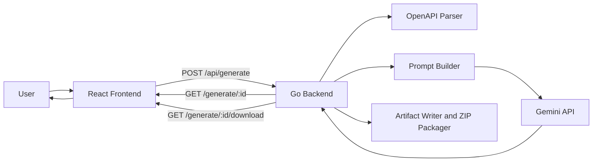
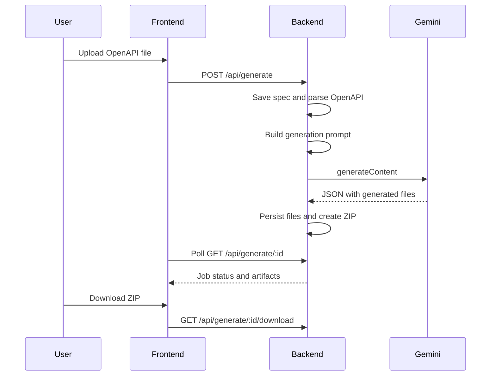

# AI Integration Copilot

Generate Go integration packages from OpenAPI specs using a Gemini-powered backend and a React frontend.

## Overview

AI Integration Copilot takes an OpenAPI file, summarizes the contract, sends a constrained generation prompt to Gemini, and returns a downloadable `.zip` containing the generated Go package.

The project currently includes:

- a Go backend that parses OpenAPI specs, runs generation jobs, stores artifacts, and exposes job status endpoints
- a React + Tailwind frontend for uploading a spec, tracking the job, and downloading the generated archive
- Docker Compose support for running the full stack locally

## Architecture



## Generation Flow



## Repository Structure

```text
backend/
  cmd/server/              HTTP entrypoint
  internal/api/            routes and handlers
  internal/ai/             prompt construction
  internal/config/         environment configuration
  internal/generator/      jobs, Gemini runner, artifact persistence
  internal/parser/         OpenAPI parsing

frontend/
  src/                     React + Tailwind app
  Dockerfile               production frontend image
  nginx.conf               static serving + /api proxy
  vite.config.js           local dev server config
```

## Requirements

- Go `1.25.1`
- Node.js `20+`
- a Gemini API key
- Docker and Docker Compose if you want to run the full stack in containers

## Environment Variables

| Variable | Required | Default | Description |
| --- | --- | --- | --- |
| `PORT` | No | `8080` | Backend HTTP port |
| `GEMINI_API_KEY` | Yes | - | Gemini API key |
| `GEMINI_MODEL` | No | `gemini-3.1-flash-lite-preview` | Gemini model used for generation |
| `GEMINI_BASE_URL` | No | `https://generativelanguage.googleapis.com` | Gemini API base URL |
| `GEMINI_TIMEOUT` | No | `2m` | Timeout for Gemini requests |

Example `.env`:

```dotenv
PORT=8080
GEMINI_API_KEY=your_api_key_here
GEMINI_MODEL=gemini-3.1-flash-lite-preview
GEMINI_BASE_URL=https://generativelanguage.googleapis.com
GEMINI_TIMEOUT=2m
```

The backend authenticates against Gemini using the `x-goog-api-key` header.

## Running Locally

### Backend

```bash
export GEMINI_API_KEY=your_api_key_here
cd backend
go run ./cmd/server
```

Backend URL: `http://localhost:8080`

### Frontend

The frontend uses Vite locally and proxies `/api` to `http://localhost:8080`.

```bash
cd frontend
npm install
npm run dev
```

Frontend URL: `http://localhost:5173`

## Running with Docker Compose

```bash
docker compose up --build
```

If you keep a `.env` file in the project root, Compose will load `GEMINI_API_KEY` automatically.

Services exposed by Compose:

- backend: `http://localhost:8080`
- frontend: `http://localhost:3000`

The frontend container serves the static app with Nginx and proxies `/api` requests to the backend container.

## Frontend Experience

The frontend currently supports:

- uploading an OpenAPI file in JSON or YAML
- starting a generation job
- tracking job progress in the UI
- listing generated artifacts after success
- downloading the generated `.zip`
- restarting the flow to submit a new spec

## API Endpoints

### `GET /health`

Health check for the backend service.

Example:

```bash
curl http://localhost:8080/health
```

### `POST /generate`

Starts a generation job.

Accepted input:

- `multipart/form-data` with `specFile`
- `application/json` with `specPath`

File upload example:

```bash
curl -X POST http://localhost:8080/generate \
  -F "specFile=@/path/to/openapi.yaml"
```

Local path example:

```bash
curl -X POST http://localhost:8080/generate \
  -H "Content-Type: application/json" \
  -d '{"specSource":"file","specPath":"/path/to/openapi.yaml"}'
```

Response includes fields such as:

- `jobId`
- `status`
- spec metadata
- prompt preview

### `GET /generate/:id`

Returns the current status for a generation job, including timings, errors, and generated file metadata when available.

Example:

```bash
curl http://localhost:8080/generate/job-123
```

### `GET /generate/:id/download`

Downloads the `.zip` artifact after the job reaches `succeeded`.

Example:

```bash
curl -O -J http://localhost:8080/generate/job-123/download
```

## Expected Model Output

The backend expects the model to return valid JSON in this shape:

```json
{
  "files": [
    {
      "path": "go.mod",
      "content": "module generated/integration"
    }
  ]
}
```

The prompt currently asks for these core files:

- `go.mod`
- `client/client.go`
- `client/models.go`
- `client/auth.go`
- `cmd/example/main.go`
- `README.md`

## Generated Artifacts

Generated files are written to temporary directories per job:

- uploaded specs: `/tmp/ai-integration-specs`
- generated artifacts: `/tmp/ai-integration-output/<job-id>`
- zip archives: `/tmp/ai-integration-output/archives/<job-id>.zip`

## Current Limitations

- `specUrl` is not implemented yet
- jobs are stored in memory only
- job history does not survive backend restarts
- generation quality still depends heavily on prompt quality and model behavior
- the pipeline is not yet template-driven or post-validated with generated tests

## Roadmap Direction

The next meaningful improvements are likely:

- stronger OpenAPI normalization before prompting the model
- better post-generation validation and rejection rules
- richer schema extraction for more reliable typing
- generated tests and stricter artifact verification

